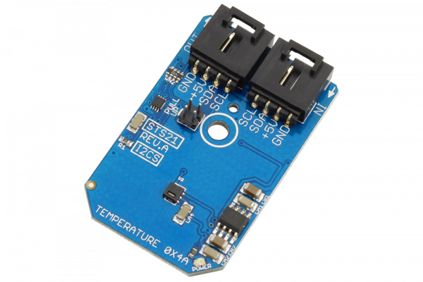

# STS21

The STS21 from Sensirion offers a low-cost high-resolution temperature measurement with outstanding specifications over a wide temperature range.Programmable resolution and 0.1 °C repeatability offer an ideal solution to temperature measurement over a wide -40 to 125°C operating temperature.
This Device is available from www.ncd.io 

[SKU: STS21_I2CS]

(https://store.ncd.io/product/sts21-high-accuracy-temperature-sensor-%C2%B10-2c-i2c-mini-module/)
This Sample code can be used with Arduino.

Hardware needed to interface STS21 sensor with Arduino

1. <a href="https://store.ncd.io/product/i2c-shield-for-arduino-nano/">Arduino Nano</a>

2. <a href="https://store.ncd.io/product/i2c-shield-for-arduino-micro-with-i2c-expansion-port/">Arduino Micro</a>

3. <a href="https://store.ncd.io/product/i2c-shield-for-arduino-uno/">Arduino uno</a>

4. <a href="https://store.ncd.io/product/dual-i2c-shield-for-arduino-due-with-modular-communications-interface/">Arduino Due</a>

5. <a href="https://store.ncd.io/product/sts21-high-accuracy-temperature-sensor-%C2%B10-2c-i2c-mini-module/">STS21 Temperature Sensor</a>

6. <a href="https://store.ncd.io/product/i%C2%B2c-cable/">I2C Cable</a>

STS21:

The STS21 from Sensirion offers a low-cost high-resolution temperature measurement with outstanding specifications over a wide temperature range.Programmable resolution and 0.1 °C repeatability offer an ideal solution to temperature measurement over a wide -40 to 125°C operating temperature.

Applications:

• Temperature monitoring systems.

How to Use the STS21 Arduino Library

The STS21 has a number of settings, which can be configured based on user requirements.
          
1.Address calling:The following command is used to call the STS21 sensor to begin the transmission.

           sts.getAddr_STS21(STS21_DEFAULT_ADDRESS);   // 0x4A, 1001'010'
            
 2.Reset:The following command is used to measure the temperature in NO HOLD Master mode.
 
            sts.setTempMode(TEMP_NO_HOLD);        // Measure Temperature, No Hold Master Mode
            
